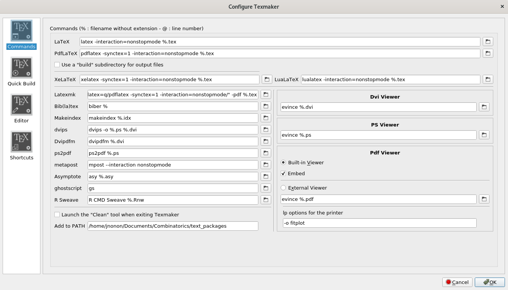
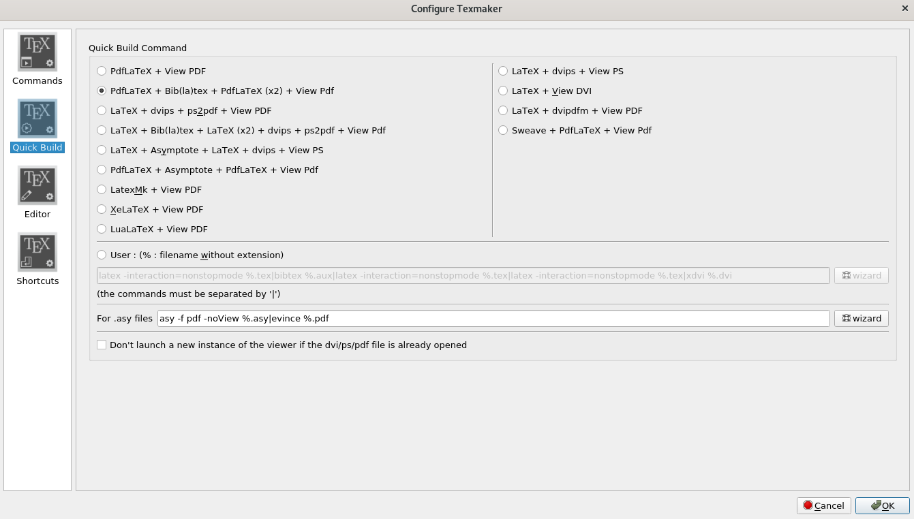

# jdf2 Now on LaTex
Welcome to Joyner Document Format (JDF) 2.0! JDF is primarily intended to standardize page lengths while ensuring readability.

This project aims to recreate JDF2 as a LaTex document. Still a work in progress, all help is welcomed.

## LaTex Packages Dependencies

* palatino
* geometry
* amsmath
* biblatex [backend biber]
* caption  For caption spacing
* listings
* subcaption % For sub-figures
* graphicx
* pgfplots
* utf8
* algpseudocode,algorithm,algorithmicx
* adjustbox
* hyperref
* enumitem % Horizontal lists
* sectsty,textcase

## Configure TexMaker

Select "Options -> Configure TexMaker"

## References:

[JDF 2.0](https://docs.google.com/document/d/1BGv3ZSeo0dop50AEwcw_VPOAEJ2IdvkwYRv5dyubUNY/edit#)

[Latex](https://www.latex-project.org/)

[TexMaker](http://www.xm1math.net/texmaker/)

[Biblatex Styles](https://en.wikibooks.org/wiki/LaTeX/Bibliographies_with_biblatex_and_biber)

[Sectsty](http://ctan.math.utah.edu/ctan/tex-archive/macros/latex/contrib/sectsty/sectsty.pdf)
